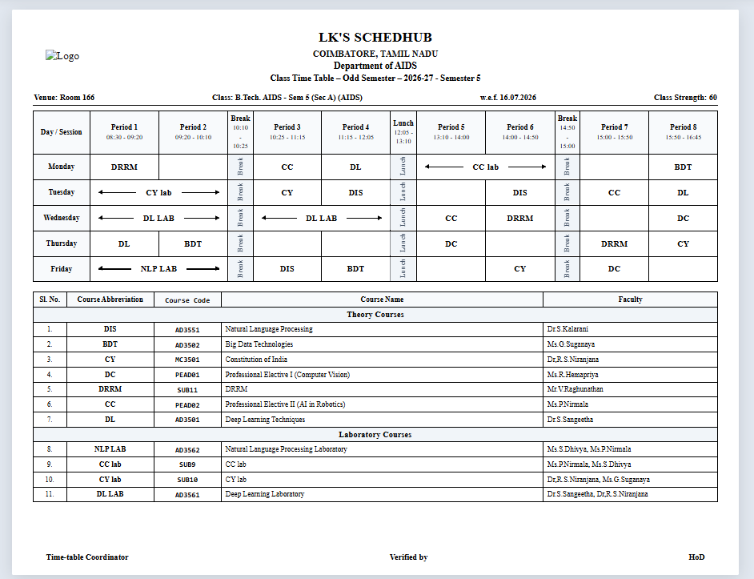

# 🏛️ Institution Auto Timetable (SchedHub v1.1.1)

An enterprise-grade, multi-tenant institutional timetable scheduling and faculty management system engineered for **Colleges, Universities, and K-12 Schools**. Features an autonomous constraint-satisfaction scheduling engine, real-time clash prevention across 20+ departments, official 1-page printable timetable generation, drag-and-drop schedule editing, dual-backend persistence (SQLite & Supabase PostgreSQL), OWASP Top 10 security hardening, and an interactive onboarding tour.

---

## 🌟 Key Highlights & Capabilities

### 1. 🎓 Real-Time Production Institutional Models
- **Engineering & Higher Education College Model**:
  - Full multi-department matrix with **Basic Sciences & Humanities (S&H)** and **Core Engineering (CSE, ECE, MECH, CIVIL, IT, AIDS)**.
  - **Shared Faculty Optimization**: Shared professors for common courses (Engineering Mathematics, Physics, Chemistry, English) taught across multiple departments with **zero double-booking clashes**.
  - **Autonomous 2-Period Laboratory Merging**: Automatic allocation of consecutive 2-period hands-on lab blocks with outward arrows (`⟵ LAB ⟶`), preventing break-crossing and ensuring subject-teacher continuity.
  - **Special Curricular Periods**: Automatic scheduling of Mentor Meetings (MM), Library periods, and non-credit courses.
- **K-12 High School Model**:
  - Primary, Middle, and High School matrices with grade-wise subject loads, core subject distribution, and physical education periods.

### 2. ⚡ Autonomous 0-Clash Scheduling Engine
- **Constraint Satisfaction & Backtracking Solver**: Enforces hard constraints (no teacher in two places at once, maximum periods per day, room capacity) and soft constraints (balanced daily workload).
- **Live SSE Generation Stream**: Timetable generation streams progress in real time via Server-Sent Events (SSE) with interactive progress bars and conflict metrics.
- **Interactive Drag-and-Drop Editor**: Rearrange class or faculty slots on the fly with live visual validation (`valid-target` green / `conflict-target` red).
- **Pre-Generation Feasibility Validator**: Scans staff-to-period ratios, weekly limits, and department loads before generation, highlighting issues with actionable recommendations.

### 3. 📄 Official Timetable Format

<p align="center">
  
  <br>
  <em>This is a sample timetable generated by SchedHub v1.1.0.</em>
</p>

- **Rotated Grid Architecture**: Modern university layout with Days as rows (Monday–Friday/Saturday) and Periods/Breaks as columns.
- **Consecutive Period Merging**: Same-subject and same-staff periods horizontally merged with outward directional arrows and combined time headers.
- **Strict 1-Page Print Resize Engine**:
  - Dynamically calculates the rendered height and scales content to fit **strictly on one single A4 landscape page** (`@page { size: A4 landscape; margin: 4mm 6mm; }`).
  - **Page Fit Toolbar Controls**: Choose between **✨ Auto-Fit 1 Page** (default), **100%**, **95%**, **90%**, **85%**, **80%**, or **75%**.
  - Includes institutional header, emblem/logo, metadata row (Venue, Class, w.e.f., Strength), full theory and laboratory course legends with faculty names, and coordinator/HoD signature blocks.
- **High-Resolution PNG Download**: One-click client-side export using `html2canvas` for sharing or physical printing.

### 4. 🏢 Multi-Tenancy & Institutional Branding
- **Complete Data Isolation**: Each registered institution operates within an isolated workspace keyed by its unique institutional code.
- **Dynamic Institutional Emblem & Logo**: Upload institution logos or generate an automated institutional shield with the college code.
- **Role-Based Access Control (RBAC)**:
  - **Creator**: Super-administrator with full control over production presets, schema, and institution parameters.
  - **Admin**: Department-level and institution-level manager with timetable generation, editing, and staff allocation privileges.
  - **Viewer**: Read-only access for students and faculty.

### 5. 🗄️ Dual-Backend Database Architecture
- **SQLite3 (Development)**: Zero-config local database (`edupro.db`) with automatic table creation, migrations, and seed data.
- **Supabase / PostgreSQL (Production)**: Seamless connection pooling via `DATABASE_URL` for cloud environments.

### 6. 🛡️ OWASP Top 10 Security Hardening & Interactive User Tour (v1.1.1)
- **Enterprise Cybersecurity Protections**:
  - **A01/A05 Access & Cookie Defense**: `/api/debug-db` lockdown with `@admin_required`, open redirect validation (`is_safe_url`), session fixation prevention (`session.clear()`), and secure `HttpOnly` / `SameSite=Lax` cookies.
  - **A02 Cryptographic Hardening**: PBKDF2:SHA256 password hashing with constant-time verification (`hmac.compare_digest`), dummy response equalization, and silent legacy hash auto-upgrade.
  - **A04 Brute-Force & Credential Stuffing Defense**: Sliding window rate limiting (`AuthRateLimiter`) enforcing 60s cooldowns after 5 consecutive failures.
  - **A07 Identification & CSRF Defense**: Cryptographic session-bound CSRF tokens across all authentication forms, plus an 8+ character password policy.
  - **A05 Security Headers**: HTTP response headers (`X-Frame-Options: SAMEORIGIN`, `X-Content-Type-Options: nosniff`, and Content-Security-Policy).
- **Interactive Side Dashboard Onboarding Tour**:
  - **100% Clear & Interactive Background**: Zero backdrop blur and zero click blocking—users can freely browse and interact with the page while the tour card floats beside the active module.
  - **Auto-Close on Background Touch**: Simply tapping or clicking anywhere on the background automatically closes the tour.
  - **Prominent "Skip for now"**: Instant single-click dismissal on every step.
  - **Smart Trigger Logic**: Triggers automatically on new college registration and on every demo login (`DEMO2024 / admin`), with a manual `Guide Tour` launcher in the topbar.

---

## 🛠️ Tech Stack

| Layer | Technology |
|---|---|
| **Backend** | Python 3.10+, Flask, Werkzeug, Gunicorn |
| **Scheduler Algorithm** | Custom Constraint-Satisfaction Heuristic Engine (Python) |
| **Database** | SQLite3 (Local) / Supabase PostgreSQL (Cloud) with `psycopg2-binary` |
| **Frontend** | Vanilla JS, Jinja2 Templates, Modern CSS (Design Tokens, Syne & Inter Typography) |
| **Print & Graphics** | ReportLab (PDF), HTML2Canvas (PNG), CSS Print Paged Media Module |
| **Deployment** | Vercel Serverless Functions, Docker, WSGI |

---

## 🚀 Getting Started Locally

### Prerequisites
- Python 3.10 or higher
- Git

### 1. Clone the Repository
```bash
git clone https://github.com/krishnanlk/Institution_Auto_Timetable.git
cd Institution_Auto_Timetable
```

### 2. Create and Activate a Virtual Environment
```bash
# Windows
python -m venv .venv
.venv\Scripts\activate

# macOS / Linux
python3 -m venv .venv
source .venv/bin/activate
```

### 3. Install Dependencies
```bash
pip install -r requirements.txt
```

### 4. Configure Environment (Optional for Local SQLite)
Copy `.env.example` to `.env`:
```bash
cp .env.example .env
```
*Leave `DATABASE_URL` blank to use the built-in local SQLite database (`edupro.db`).*

### 5. Run the Application
```bash
python app.py
```
Open your browser and navigate to:
```
http://127.0.0.1:5000
```

---

## 🔑 Demo Credentials

A pre-configured demo institution is automatically seeded on first launch:

| Field | Value |
|---|---|
| **Institution Code** | `DEMO2024` |
| **Username** | `admin` |
| **Password** | `admin123` |
| **Institution Name** | LK's Project (Engineering & S&H College) |
| **Demo Class** | CSE-A |

---

## 📂 Project Structure

```text
Institution_Auto_Timetable/
├── api/
│   └── index.py            # Vercel serverless WSGI entrypoint
├── static/
│   ├── css/
│   │   └── style.css       # Complete UI design system & 1-page print styles
│   ├── js/
│   │   └── app.js          # Client-side scripts & interactivity
│   └── uploads/logos/      # Uploaded institution logos
├── templates/
│   ├── base.html           # Master navigation & responsive shell
│   ├── login.html          # Authentication (Login / Registration)
│   ├── dashboard.html      # Overview metrics & workload analytics
│   ├── timetable.html      # Main interactive timetable grid (drag & drop)
│   ├── timetable_print.html# Official university 1-page printable format
│   ├── staff.html          # Faculty management & workload tracker
│   ├── subjects.html       # Course catalog & allocation recommendations
│   ├── classes.html        # Sections & room assignments
│   ├── analytics.html      # Workload distribution charts & rankings
│   ├── settings.html       # Institution branding, period slots & presets
│   └── user_tour.html      # Interactive side dashboard onboarding tour component
├── app.py                  # Flask application routes & SSE endpoints
├── auth.py                 # RBAC decorators, rate limiter & CSRF defense
├── config.py               # Environment configuration & DB backend detection
├── database.py             # Dual DB adapter (SQLite & Supabase PostgreSQL)
├── scheduler.py            # Constraint satisfaction scheduling engine
├── supabase_setup.sql      # PostgreSQL schema & production tables
├── requirements.txt        # Production dependencies
├── vercel.json             # Vercel serverless routing configuration
├── .vercelignore           # Deployment bundle exclusion list
├── VERCEL_DEPLOYMENT.md    # Dedicated cloud deployment guide
├── RELEASE_NOTES_v1.1.1.md # Complete v1.1.1 release notes & audit report
└── README.md               # Documentation
```

---

## 📡 Key API Endpoints

| Endpoint | Method | Description |
|---|---|---|
| `/api/timetable/class/<id>` | `GET` | Fetches timetable grid with consecutive slot merge metadata |
| `/api/timetable/staff/<id>` | `GET` | Fetches personalized faculty weekly teaching schedule |
| `/api/timetable/generate/stream` | `GET` | SSE stream for real-time timetable generation with live progress |
| `/api/timetable/validate` | `GET` | Scans workload feasibility and returns warnings |
| `/api/timetable/slot/<id>/move` | `PUT` | Moves a scheduled slot to an empty target |
| `/api/timetable/slot/<id>/swap` | `PUT` | Swaps two scheduled slots with conflict verification |
| `/api/timetable/export/csv/<id>` | `GET` | Downloads class timetable in CSV format |
| `/api/settings/presets/load` | `POST` | Switches between Engineering College and High School presets |
| `/api/settings/institution` | `POST` | Updates college name, address, logo, and metadata |

---

## 📄 License

Distributed under the MIT License. See `LICENSE` for more information.
